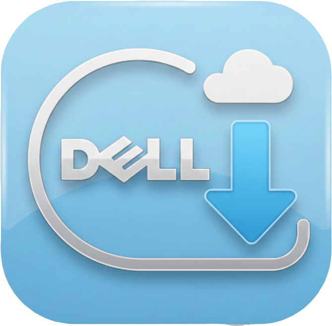

  

<h1 align="center">Dell ISO Downloader</h1>

  <strong>A modern, high-performance utility built with WinUI 3 for downloading official Dell System Images and Drivers.</strong>

  <a href="#-features">Features</a> •
  <a href="#-usage-guide">Usage Guide</a> •
  <a href="#-compilation--build">Compilation & Build</a> •
  <a href="#-author">Author</a>

---

## 📖 Introduction

**Dell ISO Downloader** is a lightweight, portable application designed to simplify the retrieval of system recovery media. By leveraging a valid **Dell Service Tag**, this tool interact directly with Dell's official content servers to fetch the exact Operating System ISOs, Driver Packs, and SOS/WIM recovery files tailored specifically for your device.

Powered by **.NET 8** and the **Windows App SDK (WinUI 3)**, it features a built-in **Aria2** download engine to ensure maximum speed and reliability, all packaged into a clean, single-file executable.

---

## ✨ Features

- **🚀 Smart Retrieval**: Instantly fetches the correct Windows version, drivers, and recovery tools for your specific hardware configuration.
- **⚡ High-Speed Engine**: Integrated multi-threaded Aria2c downloader ensures the fastest possible speeds directly from Dell servers.
- **🛠️ Portable & Clean**: Compiles into a single, standalone `.exe` file. No installation required; no registry clutter.
- **💻 Native Performance**: Optimized for both **x64** and **ARM64** Windows devices.
- **🎨 Fluent Design**: A beautiful, native user interface that supports Windows Light and Dark themes.
- **📂 Bulk Operations**: Support for selecting and downloading multiple files (ISOs, Drivers, and WinPE environments) simultaneously.

---

## 🚀 Usage Guide

Follow these steps to successfully download your recovery media:

### 1. Configuration (Recommended)
Before starting, click the **Settings (⚙️)** icon at the bottom-left of the window.
- Set your preferred **Download Folders** for ISOs, Drivers, and WIM files.
- (Optional) You can leave the "Threads" setting on `AUTO` for the best balance of download speed and system stability.

### 2. Fetch Data
1. Navigate to the **Home** tab.
2. Locate the **Service Tag** input box at the top.
3. Enter your Dell machine's Service Tag (e.g., `ABC1234`).
4. Click the **Get Data** button.
5. The application will authenticate with Dell servers and retrieve the file manifest.

### 3. Select Content
Once the data is loaded, the available files will be categorized into three lists:
- **ISO**: Full Windows operating system recovery images.
- **Drivers**: Complete driver bundles for deployment.
- **WIM/RE**: Recovery Environment and WinPE files.

Use the checkboxes to select the specific files you need. You can use the toggles to "Select All" in a category.

### 4. Download
1. Click the **Download** button at the bottom-right corner.
2. The built-in download manager will start immediately.
3. You can monitor the download speed, progress percentage, and ETA in real-time at the bottom of the window.
4. Once completed, you can click **"Open Folder"** in the Settings menu to access your downloaded files.

---

## 🛠 Compilation & Build

This project is optimized for **Visual Studio 2026** and utilizes advanced .NET 8 features. Please follow these detailed steps to compile the source code into a working executable.

### 📋 Prerequisites

Ensure your development environment is set up with the following:

1. **Visual Studio 2026** (Preview or Stable).
2. **Workloads** (Select these during VS installation):
   - *.NET Desktop Development*
   - *Windows Application Development (Windows App SDK)*
3. **Runtime**: .NET 8.0 SDK.

### ⚙️ Build Process

#### Step 1: Clone the Repository
Clone the source code to your local machine:

    git clone [https://github.com/YourUsername/Dell-ISO-Downloader.git](https://github.com/YourUsername/Dell-ISO-Downloader.git)
    cd Dell-ISO-Downloader

#### Step 2: Open Solution
Launch Visual Studio 2026 and open the **`DellISO.slnx`** (or `.sln`) file found in the root directory.

#### Step 3: Restore Dependencies
1. Right-click the **Solution** in the *Solution Explorer* pane.
2. Select **Restore NuGet Packages**.
3. Wait for the Output window to confirm that all packages (CommunityToolkit, WinAppSDK, etc.) are restored.

#### Step 4: Publish (Crucial Step)
> **⚠️ Important**: This project uses a custom `.csproj` configuration to enable **Single-File** mode and **Unpackaged** deployment. Using the Visual Studio "Right-click -> Publish" GUI wizard often results in errors. **Using the command line is the recommended and stable method.**

1. Right-click the project folder in File Explorer and select **"Open in Terminal"** (or open PowerShell and `cd` to the project folder).
2. Run one of the following commands based on your target architecture. The project is configured to automatically detect the platform and build the correct binary.

**For Standard PCs (x64):**

    dotnet publish -c Release -r win-x64

**For ARM Tablets/Laptops (ARM64):**

    dotnet publish -c Release -r win-arm64

*The build script will automatically handle platform targeting, resource embedding, and compression.*

#### Step 5: Locate the Executable
Once the command finishes successfully, your portable application will be located here:

    bin\Release\net8.0-windows10.0.19041.0\win-x64\publish\DellDownloader.exe

(Or `win-arm64` if you built for ARM). You can now move this `.exe` file anywhere; it does not require any installation.

---

## 👤 Author

**Made By Littlenine Ennea**

-  **Telegram**: [t.me/@Littlenine](https://t.me/Littlenine)

---

> **Disclaimer**: This software is an independent utility and is not affiliated with, endorsed by, or connected to Dell Technologies Inc. All system images and drivers are downloaded directly from Dell's public support servers without modification. Use at your own risk.
